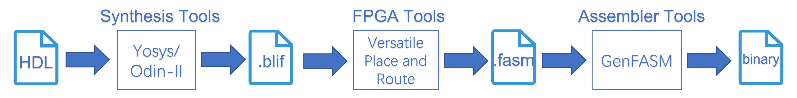

# **Adapting the Symbiflow 7-Series FPGA Models for Architectural Exploration**

- [Motivation](#motivation)
- [Background](#background)
  - [Symbiflow and VPR](#symbiflow-and-vpr)
  - [Project X-Ray and Xilinx 7-Series FPGA](#project-x-ray-and-xilinx-7-series-fpga)
  - [Terms to Know](#terms-to-know)
- [Roadmap](#roadmap)
- [Current Progress](#current-progress)
  - [Prerequisites](#prerequisites)
    - [Architecture and Routing Graph](#architecture-and-routing-graph)
    - [Grid Visualizer](#grid-visualizer)

  - [Coordinate System Difference](#coordinate-system-difference)
    - [Direction Difference](#direction-difference)
    - [Horizontal Shift](#horizontal-shift)
    - [Vertical Shift](#vertical-shift)
  - [Routing Graph of CLB](#routing-graph-of-clb)
    - [Cardinal Segments](#cardinal-segments)
    - [Non-cardinal Segments](#non-cardinal-segments)
    - [Short-range to Mid-range Adjacency Analysis](#short-range-to-mid-range-adjacency-analysis)
- [To-DO List](#to-do-list)
- [Resources](#resources)

# Motivation

This repository is to record my work done in EPFL@Summer. Many to-do lists need to be completed in the future. Hope it can help you one day.

Let me give a brief overview of our plan. You may click [here](#roadmap) for details. We’d like to figure out how routes are placed in FPGA and how they influence performance. Based on my current knowledge, place and route are done automatically by Vivado. You are allowed to do global and detailed routings. No matter which method you use, we are still in the software-level, such as choosing various routing algorithm or configuring a crossing point. But for the physical level, we have no right to change it but just use it.

Thanks to Symbiflow and VPR, now we are able to look into this physical stuff (Symbiflow is an open-source toolchain of FPGA, from synthesis to bitstream, whose bitstream can be run in commercial FPGAs. VPR is one of tools integrated in Symbiflow, responsible for packing, placing, routing and time analysis). For example, the architecture and routing graph of Xilinx 7 series are cracked and recorded as files, meaning that exploring design logic of this series is possible. In other words, there must be some templates used in the architecture and routing graph. To be specific, each component of FPGA is a module with the same architecture and routing method. If we can figure it out, like lego, next time when you want to build something or test a new algorithm, you can do it in your customized board with full control. I think that’s the final significance of our work, rather than only working on how routes impact performance.

# Background
## Symbiflow and VPR

First, I'll introduce basic tools used in this project, Symbiflow and VPR. Symbiflow is an open-source toolchain for FPGA, currently targeting Xilinx 7-Series, Lattice iCE40 and Lattice ECP5 FPGAs. With Symbiflow, you can generate bitstreams running well in FPGA boards. Just think of it as an open-source version of Vivado or Quartus. 



The above is a simplified file flow of Symbiflow, including synthesis, FPGA, and assembler tools generating multiple intermediate files. For details, you may browse the [webpage](https://symbiflow.github.io/) and read its [paper](https://ieeexplore.ieee.org/document/9103284).

Apart from Symbiflow, VPR, one of tools in Symbiflow, is also used in our project, which is short for Versatile Place and Route. It not only helps you place and route, but evaluate performance of various configurations. In subsequent sections, I'll show you how to extract architectures and routing graphs through VPR. Some new terms? Don't worry, all of those new stuff will be illustrated later.

## Project X-Ray and Xilinx 7-Series FPGA

Since we have those powerful tools, you may wonder how to implement a design in a given FPGA board. That's the job of Project X-Ray. Project X-Ray is part of works on FPGA cracking. The following graph introduces its basic working flow. X-Ray utilize a test method from software development, called Fuzz Testing. A fuzzer database is created with tons of design and each design is implemented by commercial toolchains, like Vivado. Through comparing tiny differences among bitstreams, we can infer functionalities of part of configure profiles. Executing this loop again and again, we can describe the architecture and routing graph of a specific FPGA board. After that, these results are integrated with VPR and works for placing and routing in Symbiflow. In this way, running bitstreams from Symbiflow in commercial FPGA is possible.


Since you get familiar with those tools, let's talk about our target, Xilinx 7-Series FPGA. Although 7-Series FPGA is not the latest product, its design and optimization are worth to learn and mimic. 

Another question may be raised: Why do we choose this project. The following screenshot from Symbiflow can solve your confusion, showing current progress of each project. Lacking full support to Advanced Tiles considerably simplifies our research and makes us focus on the fundamental structure of FPGA. Once we figure out how logic tiles are organized and optimized, RAM and other advanced tiles will be the next. Additionally, we happen to have a version of Xilinx 7-Series FPGA in the lab, easily to test the output.


## Terms to Know

Preparing knowledge of several terms will help you understand our work.

Architecture: A file to describe the architecture of FPGA. VTR uses an XML-based architecture description language to describe the targeted FPGA architecture. This flexible description langauge allows the user to describe a large number of hypothetical and commercial-like FPGA architectures. For a detailed reference on the supported options, click [here](https://docs.verilogtorouting.org/en/latest/arch/reference/#arch-reference).

Routing Resource Graph (rr graph): An XML file that describes the routing resources within the FPGA, including but not limited to positions of components, wirings, I/O, and switches. It offers you a large amount of routing information, even a single wire from one logic tile to another tile. Normally, this file is encoded as a binary exe file, as an input of VPR. You can use `--write_rr_graph` option to output a human-readable format. Details are discussed in the subsequent section, Prerequisites. Click [here](https://docs.verilogtorouting.org/en/latest/vpr/file_formats/#routing-resource-graph-file-format-xml) and jump into file formats. 

Segments or Wires: Segments or wires are connections between two switches, divided into two types: cardinal and non-cardinal segments. It's easy to tell their difference: with or without turn. Every segment is named with its direction plus a number, representing the number of switch it crosses. For example, WW2 means its direction is west and it crosses 2 switches. Another noticeable segment is stub(in green), which starts from a segment and ends at a switch.


# Roadmap

Let me give you a big view of our project. Our roadmap is shown as follow.


As mentioned in the Motivation part, we need a customized FPGA board or grid, only containing basic tiles, to evaluate routes or segments through max frequency calculation done by VPR. To precisely get expected results, 3 files are fed to VPR, rr graph, architecture and circuits design. The first two files are called Device Model, describing details needed for a FPGA. Circuits design act as a benchmark. To be simple, we evaluate the speed(Max Frequency) of various device models with the same circuits.

RR Graph are generated through 3 phase:

 1. Extract original rr graph from Project X-Ray using VPR. The format of rr graph changes from .exe to .xml within this process.

 2. Use script1 to analyze the previous file and extract a template rr graph of CLB (Configurable Logic Block, Logic Cell, or Logic Tile). This template contains necessary segments or wires. We call the phase from `Original RR_Graph` to `Template of CLB` Routing Extraction.

 3. Based on the size of our customized FPGA board (named with Grid Input), use script2 to link all CLBs and generate a complete rr graph for VPR calculation.

Further details of phase 3 are shown. Each CLB connects to other CLBs in a defined manner to assembly a CLB grid. Then, we add I/O ports around this grid and get a customized FPGA board. 


Architecture generation is much easier than that of rr graph because formats of elements are fixed and strict. Following the same idea, we dig out a piece of contents of CLB and assembly them according to the sized of our grid using script3. Note that Project X-Ray consists of rr graph and architecture of Xilinx 7-Series FPGA. That's the source of our project.

Finally, we get all three stuff and it's time to do deep research on how routing impacts performance of FPGA.

# Current Progress

## Prerequisites

### Architecture and Routing Graph

This section is to illustrate how to prepare these two files from Symbiflow Project. You can also directly download them from this repository if encountering any failure.

1.Clone this repository: [symbiflow-arch-defs](https://github.com/SymbiFlow/symbiflow-arch-defs), which contains documentation of various FPGA architectures and demos for tests.

2.`make env` to set up the build system. Don't waste time on building all demos. One demo is enough. The demo directory of Xilinx 7-Series is `symbiflow-arch-defs/xc/xc7` and it teaches you how to run a demo.

3.Change the directory to `symbiflow-arch-defs/build/xc/xc7/tests/buttons/` after you have the build system. Then `make buttons_basys3_full` to compile this project. You may add `-j thread_num` to accelerate this procedure. Btw, basy3 is an entry-level FPGA development board featuring the Xinlinx Artix7-FPGA architecture (XC7A35T).

4.After the successful compilation, you will have many intermediate files, like `.place` and `.route`. `top.bit` is the bitstream for your board execution. What we care about are the logs during the build, especially `route.log`

5.In the `route.log`, we can find commands used with complex options. The following is the my command to generate rr graph of XC7A50T. 

```shell
/home/myz1237/Desktop/symbiflow-arch-defs/env/conda/envs/symbiflow_arch_def_base/bin/vpr /home/myz1237/Desktop/symbiflow-arch-defs/build/xc/xc7/archs/artix7/devices/xc7a50t-virt/arch.timing.xml /home/myz1237/Desktop/symbiflow-arch-defs/build/xc/xc7/tests/buttons/buttons_basys3_full/artix7-xc7a50t-virt-xc7a50t-test/top.eblif --device xc7a50t-test --read_rr_graph ~/Desktop/test_full_size/rr_graph_xc7a50t-basys3_test.rr_graph.real.bin --max_router_iterations 500 --routing_failure_predictor off --router_high_fanout_threshold -1 --constant_net_method route --route_chan_width 500 --router_heap bucket --clock_modeling route --place_delta_delay_matrix_calculation_method dijkstra --place_delay_model delta --router_lookahead extended_map --check_route quick --strict_checks off --allow_dangling_combinational_nodes on --disable_errors check_unbuffered_edges:check_route --congested_routing_iteration_threshold 0.8 --incremental_reroute_delay_ripup off --base_cost_type delay_normalized_length_bounded --bb_factor 10 --acc_fac 0.7 --astar_fac 1.8 --initial_pres_fac 2.828 --pres_fac_mult 1.2 --check_rr_graph off --suppress_warnings /home/myz1237/Desktop/symbiflow-arch-defs/build/xc/xc7/tests/buttons/buttons_basys3_full/artix7-xc7a50t-virt-xc7a50t-test/noisy_warnings.log,sum_pin_class:check_unbuffered_edges:load_rr_indexed_data_T_values:check_rr_node:trans_per_R:check_route:set_rr_graph_tool_comment:calculate_average_switch --read_router_lookahead /home/myz1237/Desktop/symbiflow-arch-defs/build/xc/xc7/archs/artix7/devices/rr_graph_xc7a50t_test.lookahead.bin --read_placement_delay_lookup /home/myz1237/Desktop/symbiflow-arch-defs/build/xc/xc7/archs/artix7/devices/rr_graph_xc7a50t_test.place_delay.bin --write_rr_graph test_full_size.xml
```

`--read_rr_graph` indicates the location of Symbiflow DB, Project X-Ray. `rr_graph_xc7a50t-basys3_test.rr_graph.real.bin` is the binary file recording complete routing graph. But it is not a human-readable version. 

Add `--write_rr_graph` option to output this binary file in am XML format. 

Apart from rr_graph, the following architecture file can be found in `/home/myz1237/Desktop/symbiflow-arch-defs/build/xc/xc7/archs/artix7/devices/xc7a50t-virt/arch.timing.xml `Now, we get the **original rr_graph** and **current architecture file**.

If you read carefully, you must be confused about the difference of XC7A35T and XC7A50T: Why we compile a project for XC7A35T but files of XC7A50T are used during this procedure.  Based on the knowledge we know and observation, XC7A35T and XC7A50T use the same architecture and routing resource graph but XC7A35T only implements a part of design of XC7A50T. Actually, there is no architecture or rr graph file for XC7A35T. The screenshots also prove the similarity of both designs. 


### Grid Visualizer

A convenient tool provided by the above repository is introduced in this section: grid visualizer. You can find it in `symbiflow-arch-defs/utils/grid_visualizer`. It can load the grid definition from various sources (project-xray database files, arch.xml, rr_graph.xml, SQL database) and render it to a SVG/PDF file.

Why we need such a tool? It not only gives you a clear view of all components of FPGA with their names and locations, but helps you learn Vivado/Symbiflow and VPR coordinate systems. 

Generate grid in Vivado/Symbiflow coordinate system:

```shell
python3 /home/myz1237/Desktop/symbiflow-arch-defs/utils/grid_visualizer/grid_visualizer.py --tilegrid ~/Desktop/prjxray-db/artix7/xc7a50t/tilegrid.json -o grid.pdf
```

You can find Project X-Ray DB files in this [repository](https://github.com/SymbiFlow/prjxray-db)

Generate grid in VPR coordinate system:

```shell
python3 /home/myz1237/Desktop/symbiflow-arch-defs/utils/grid_visualizer/grid_visualizer.py --graph-xml /home/myz1237/Desktop/rr_graph_xc7a50t.xml -o grid.pdf
```

Note that this command may occupy amount of memory and it takes a long time to complete. 

Both of grid files can be downloaded in this repo.

## Coordinate System Difference

As we mention above, there are two coordinate systems, Vivado/Symbiflow and VPR. Both Vivado and Symbiflow use the same coordinate system, while VPR makes some changes. 

### Direction Difference

An obvious difference is the direction. 

- In Symbiflow, North is y-positive and East is x-positive

- In VPR, South is y-positive and East is x-positive


Consequently, coordinates are different in two systems. You can compare two pdf files from grid visualizer to get a clear understanding.


### Horizontal Shift

Except for the direction change, VPR shifts the system horizontally and vertically due to lack of some elements. 

An extra empty column on the left side, caused by VPR. VPR doesn’t have channels right or above tiles on the right most / left most edge. To get these channels, VPR pads the left most / right most edges with EMPTY tiles. Check this [web](https://symbiflow.readthedocs.io/en/latest/symbiflow-arch-defs/docs/source/development/vtr_notes.html) for details.


Due to this design, all elements in the grid have to shift left 1 unit.


The above shows that VPR shifts all blocks left 1 unit. INT_L and INT_R represent switches located around the CLB. Failing to recognize INT blocks, VPR tag them with EMPTY block.

### Vertical Shift

Condition of vertical shift is more complex. Multiple empty tile rows at 0th , 52nd , 105th , 158th. Left column is Symbiflow coordinate system and the right is VPR coordinate system. Those moves can be proven in the previous pdf files.


Possible Reasons of shifts:

- Padding with empty tiles, as the same as the horizontal shift.
- Reserve for clock regions. Row 52nd and 105th are clock regions in Symbiflow coordinate system. VPR may apply the same strategy (Padding with empty tiles) to clock rows due to lack of recognition.

## Routing Graph of CLB

Actually, it is these contents that further our research. Coordinate System Difference is just an extra finding in my journey. This section, I will illustrate current progress of extraction of CLB routing graph, I mean the template in our roadmap. 

Since we know the similarity between XC7A35T and XC7A50T, we can refer past research on XC7A35T to prove whether our results of XC7A50T are correct. We use the [paper](NetCracker: A Peek into the Routing Architecture of Xilinx 7-Series FPGAs), *NetCracker: A Peek into the Routing Architecture of Xilinx 7-Series FPGAs*, as reference. 

### Cardinal Segments

The left graph shows statistic results from the paper, counting the number of segment of each direction. The right are results from our script, which recognizes and extracts cardinal segments within rr graph according to their features. 

`SS2 4 (0,2)` represents the South segment, whose length is 2 and vector is (0, 2). The number of it is 4.

Because we've not known how stub is recorded in rr graph, only segments are counted in our script.


### Non-cardinal Segments

The same process is done in non-cardinal segments, but we separate them into mid-range and short-range connections. Mid-range is 6 and short-range is 2. Each non-cardinal segment consists of two wires linked by a [short](https://docs.verilogtorouting.org/en/latest/arch/reference/#switches) switch (Directly bond together with single direction). So we tag two wires with A and B, like `SW6-A` and `SW6-B`.

Different from our expectation, the shape of mid-range wire is not like `turn left` or `turn right` traffic signs, but a `T`. Additionally, the number of North segments including NW and SW doubles. 


Short-range has the same issue.


Possible reason:

- Redundant segments are stubs. Stubs are counted accidently without any knowledge of it. More research needs to be done.

### Short-range to Mid-range Adjacency Analysis

The left hotmap is from the above paper. We did a familiar research on XC7A50T. Note that many issues should be handled in the right hotmap, including incorrect counting and strange 0 areas.


# To-DO List

It looks like we have done something, but things are worse than we expect. Staring at our roadmap, we are in the routing extraction phase and our script1 obviously does not cover all situations.

Future Plans:

1.Routing Extraction

- Figure out the description of stub in rr graph. 
- Recount cardinal and non-cardinal segments.
- Except for short and mid range segments, length-1 wires are unknown

2.RR Graph Auto Generation

3.Feature Extraction from Architecture Files and Reconstruction

# Resources

Big files are not suitable to store in github, I put them here.

[architecture_file_xc7a50t](https://drive.google.com/file/d/13PhDeW8AHUGEQ4Dv_jBkwMg56OoJMche/view?usp=sharing)

[rr_graph_xc7a35t&_xc7a50t](https://drive.google.com/file/d/1EEefh6QUzJT-ZnETAQrJTUgE46VeKITM/view?usp=sharing)

[grid_visualizer_symbiflow](https://drive.google.com/file/d/16heOdwvqQQtjOBbG7dq04lzyOUV7XNra/view?usp=sharing)

[grid_visualizer_vpr](https://drive.google.com/file/d/1e3z5c-ECnJ_tjoCo45bCQBTc626rajMW/view?usp=sharing)
